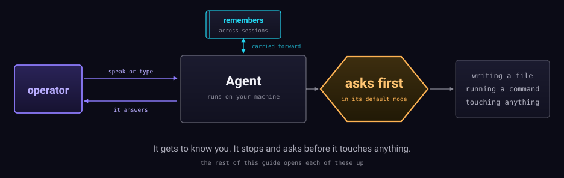

An assistant that runs on your machine, remembers you across sessions, and
asks, by default, before it writes to a file or runs a command.

That drawing is the whole product in one line. The rest of this guide opens
each part of it up.

## Start here

- **[What it is](start/what-it-is.md)** — the idea, in a page.
- **[Install](start/install.md)** — getting it running.
- **[Your first hour](start/first-hour.md)** — what to try, and what to expect.

## How it works

The system is drawn at three levels of detail. Read down only as far as you
need — most people stop at the second.

| | |
| --- | --- |
| **L0** | [What it does](diagrams/L0-what-it-does.svg) — no jargon, ten seconds |
| **L1** | [System context](anatomy/system-context.md) — every loop that touches a turn |
| **L2** | [The agent loop](anatomy/agent-loop.md) · [Voice](anatomy/voice.md) · [Memory](anatomy/memory.md) · [Autonomy](anatomy/autonomy.md) · [Delegation](anatomy/delegation.md) |

## Reference

- [Permissions](mechanisms/permissions.md) — what it will and will not do
- [Memory and the vault](mechanisms/memory-and-vault.md) — two stores, two jobs
- [Prompts](mechanisms/prompts.md) — what the model is actually told
- [Workspace](mechanisms/workspace.md) — the files the assistant keeps about itself
- [What it asks before doing](reference/permissions.md) — generated from the gate's own config
- [Tools](reference/tools.md) · [Models and roles](reference/models-and-roles.md) · [Configuration](reference/config.md) · [Costs](reference/costs.md)

Everything under `reference/` is generated from the running code, and the
diagrams and pages are checked against the same facts. A number that no
longer matches the code fails the build wherever it sits — a generated
table, a label inside a drawing, or a sentence on a page like this one.
