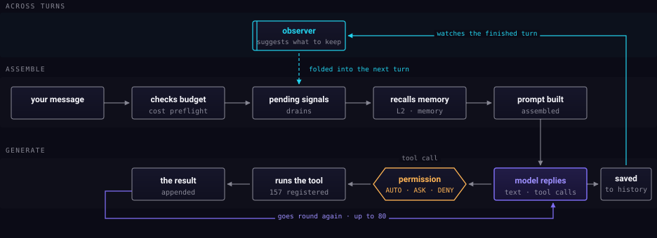

One message, end to end.

## Assemble

Nothing reaches the model until three things happen. The turn is **priced**
against the budget and refused outright if there is no headroom. **Pending
signals** — things that finished while you were away — are folded in. And
memory is **recalled**, which is its own four-stage pipeline; see
[Memory](memory.md).

Only then is the prompt built.

## Generate

The model replies with text, tool calls, or both. This is where the loop is.

A tool call does not end the turn. It goes through the **permission gate**,
runs, and its result **re-enters the same turn** — so the model can act, look
at what happened, and act again. That repeats up to a hard cap, which exists so
a confused model cannot spin forever.

The gate sits *inside* the loop, not before it. Every call is judged on its
own; approving one thing never approves the next.

## Across turns

The finished turn is saved to history — that is what the next turn is built
from, and what survives a reload.

The **observer** sits above the loop because it belongs to no single turn. It
reads a turn after it finishes, decides what was worth keeping, and its
suggestions are folded into the *next* turn's assembly. That is why it touches
both ends: it watches one turn and speaks into another.
