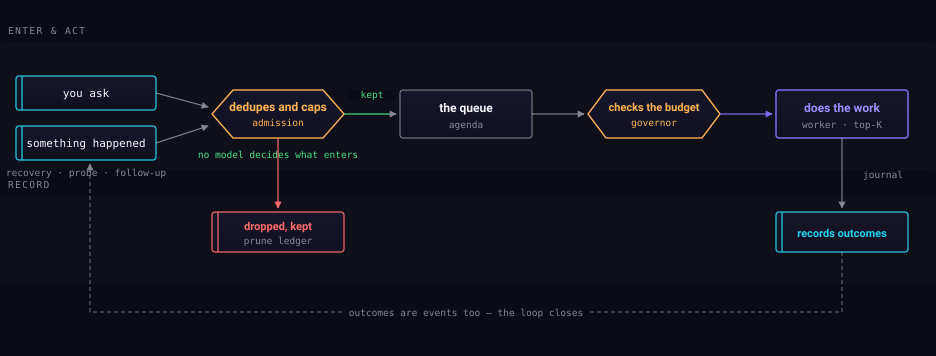

The part with no operator in it.

## Signals become candidates

A heartbeat reads what has changed since it last looked — workspace events,
memory writes, and the deliberate proposers. If nothing has changed it does not
call a model at all, which is the difference between a system that idles and
one that bills you for idling.

## Two gates before anything is spent

This is the part worth understanding, because it is what makes unattended
operation safe rather than alarming.

**The vetter judges each idea before it can be acted on.** It can reject a
proposal outright or merge it into something already queued. Rejections are
written to a ledger rather than deleted — you can go and read what it decided
not to do.

**The governor decides whether anything may run at all.** It parks work whose
source you have paused, and work whose lane has no budget headroom left.

Only what clears both gates reaches a worker.

## The loop closes

Outcomes are journaled — and an outcome is itself a signal, so what autonomy
did last time is part of what it notices next time.
