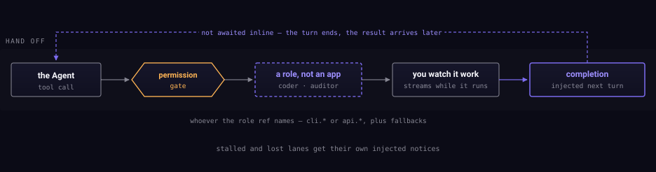

Handing work to something better suited to it.

## A seat, not a program

`coder` and `auditor` are **roles**, not applications. Whatever the
configuration points a role at is what fills the seat — a CLI covered by a
subscription today, a metered API tomorrow, with fallbacks behind it. Nothing
above the seat changes when it is refilled.

This is why the guide never names a model as though it were a component. See
[Models and roles](../reference/models-and-roles.md) for what each role
currently ships pointing at.

## It does not block

A delegate runs asynchronously. The turn that handed off **ends** — it does not
sit open waiting — and the completion is injected into a later turn when it
arrives. You can watch the work stream while it runs.

That asynchrony is what makes the seat swappable at all: since nothing upstream
waits on it, nothing upstream cares whether the thing in the seat takes two
seconds or twenty minutes.

Runs that stall or vanish get their own notices rather than disappearing.
