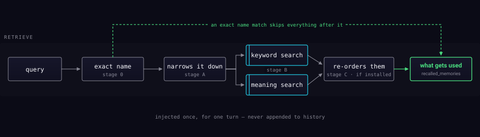

What the assistant knows about you, and how it finds it.

## Four stages, each able to answer alone

Retrieval is a ladder, and most queries never reach the top of it.

**An exact name match short-circuits everything after it.** Refer to something
by its name and that is the answer — no embedding is computed. This is the
cheap path, and it is the common one.

Otherwise a prefilter narrows the candidates, then two searches run over the
full index: **keyword search** finds the words you used, **meaning search**
finds the ones you did not. Their results are merged.

**Re-ordering runs only if it is installed.** It depends on a model and a
runtime that may not be present; when they are missing the stage disables
itself and retrieval keeps the merged ordering. It is not a setting you switch
on — it is a capability you either have or do not.

## Injected, not appended

What comes back is injected into that one turn. It is not appended to your
conversation history, so it does not accumulate and does not slowly crowd out
the thing you were actually talking about.

Memory also decays and consolidates. The goal is a store that gets sharper, not
one that gets bigger — see
[Memory and the vault](../mechanisms/memory-and-vault.md) for how it differs
from the research library, which is designed never to forget.
