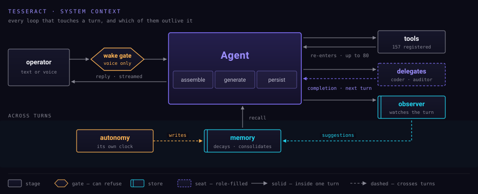

Everything that touches a turn, and which of it outlives one.

## Reading the drawing

Every later diagram reuses this notation, so it is worth thirty seconds:

- a **rectangle** is a stage — something happens here
- a **hexagon** is a gate — it can refuse
- a rectangle with a **doubled left edge** is a store — something is kept
- a **dashed rectangle** is a seat — a role, filled by whatever the config names
- a **solid arrow** stays inside one turn; a **dashed arrow** crosses turns

That last distinction carries most of the surprising behaviour in the system.
Anything dashed means the result arrives later, on a turn you have not sent yet.

## The shape of it

One operator enters by text or by voice; voice passes a gate that can refuse
it. The turn replies to the same operator — that is the loop you experience.

Around that sit three relationships, ordered by how long each takes to close:

| Loop | Returns | Drawn |
| --- | --- | --- |
| Tools | inside the same turn | solid |
| Delegates | on a later turn | dashed |
| Observer | into memory, for a future turn | dashed |

Below the line is the machinery with no operator in it: autonomy runs on its
own clock, and memory is the store both it and the observer write to while the
turn reads from it.
