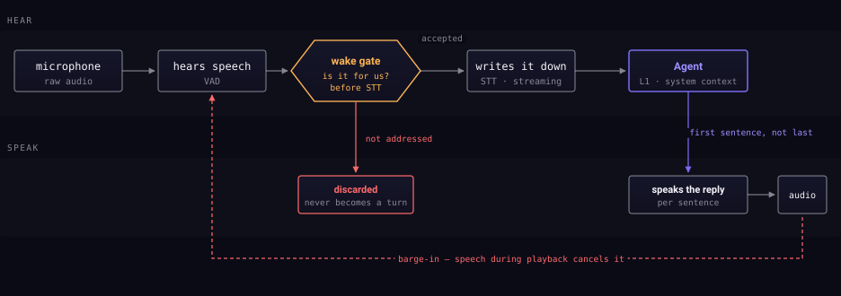

Voice is the primary way in, not a bolt-on.

## Hearing

The microphone produces a continuous stream. Voice activity detection separates
speech from silence, and speech is transcribed as it arrives rather than after
you stop talking.

## The gate

Then the interesting part. Not everything said in a room is addressed to the
assistant, so an utterance has to clear a **wake gate** before it becomes a
turn.

The gate listens to the **sound** of the phrase, not to a transcription of it:
a recogniser restricted to your two words, which hears them or hears nothing.
That ordering matters more than it looks: because the decision needs no
transcript, speech that was not addressed to the assistant is **never
transcribed at all**. It does not reach a speech engine, local or otherwise.

An utterance that fails is **discarded down a different path**. It does not
become a quiet turn, and it does not become a turn you have to undo.

The wake word passes everything through until you have said the phrase once in
Settings and watched it land — see
[The wake word](../mechanisms/wake-word.md).

## Speaking

The reply is spoken sentence by sentence as it is generated, starting with the
first sentence rather than waiting for the last — which is what makes it feel
like an answer rather than a recital.

Speaking while it speaks cancels playback. You never have to wait your turn.
