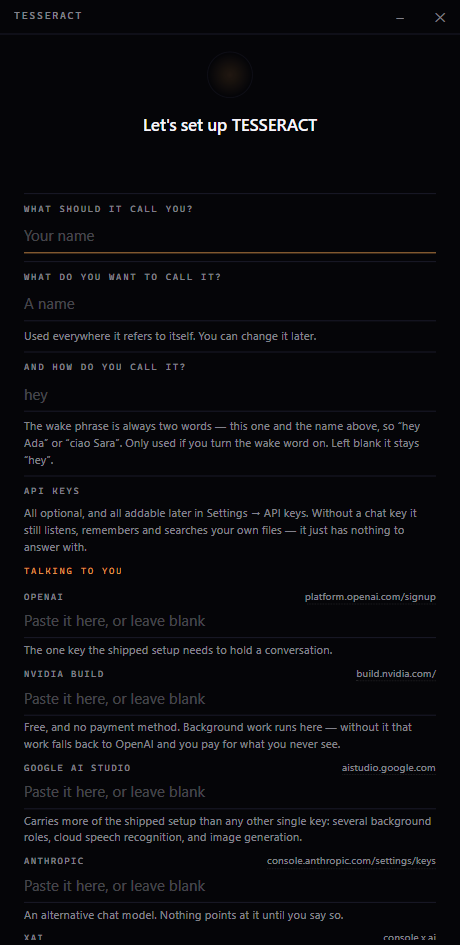
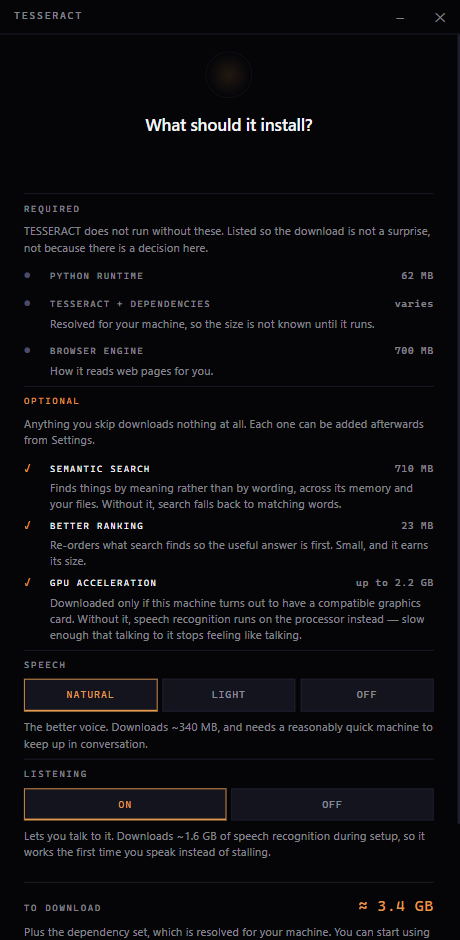
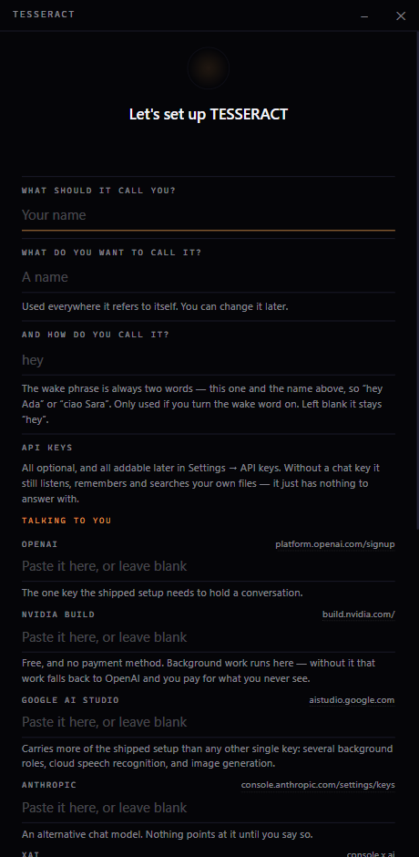

# TESSERACT

TESSERACT is a personal assistant that runs on your own Windows machine. You name it, you talk to it, and it remembers — across days, not just within a conversation.

## What it is

Most AI assistants forget you between sessions and can't safely do anything on your behalf. TESSERACT is the layer that fixes both.

It is a runtime that gives an assistant:

- **Long-term memory that consolidates rather than hoards** — it decays and merges what it knows instead of accumulating everything forever.
- **An append-only research vault** it can search and synthesize from, kept separate from memory so research never contaminates recall.
- **A tool registry with a real permission model** — every file write, shell command, and outbound call is gated by policy, and the default posture asks you first.
- **An orchestration kernel** that runs background and scheduled work with durable state and crash recovery, so a job survives a restart instead of vanishing with the process.

It is **model-agnostic by design**. API providers, subscription CLIs, and local models all plug into the same role wiring, so swapping the brain is a config change, not a rewrite — see [You aren't tied to OpenAI](#you-arent-tied-to-openai).

The interface is a desktop app: voice-first, with a visual HUD.

Everything it remembers is plain files on your disk — Markdown you can open, read, and edit. Nothing is locked in a database.

**On what leaves your machine:** hearing you, speaking, memory, and search all run locally and cost nothing. The language model it thinks with is whichever one you point it at — the shipped default is OpenAI, so by default your conversation does go to a provider. Point it at a local model instead and it doesn't. That choice is yours and it is one config field.

## Install

1. Download the installer: **[TESSERACT-Installer.exe](../../releases/latest/download/TESSERACT-Installer.exe)**. That link always gives you the current version — bookmark it rather than a release page. What changed in each version is in [CHANGELOG.md](CHANGELOG.md).
2. Run it. Windows will show a blue screen titled **"Windows protected your PC"**, and the only button on it says **"Don't run"**.

   This is expected. The app isn't code-signed yet, so Windows has no history with it and treats it as unknown by default — the same thing happens to any new small app until enough people have run it. To get past it: click **"More info"**, then click **"Run anyway"**.

   You only have to do this once per machine, not every time you open TESSERACT.

3. Follow the installer. It installs just for your Windows user account, so it won't ask for admin permission.

### Opening it

TESSERACT appears in your Start Menu — just search for it. Opening it a second time while it's already running brings the existing window back rather than starting a second copy.

## First run

The first time you open TESSERACT, a setup screen walks you through two steps before anything else happens.



**It asks what to call it.** The assistant ships without a name — deliberately. A shipped stand-in name would be indistinguishable from one you chose, so an install whose setup quietly failed would look configured instead of looking unnamed. You give it a name here, and you tell it what to call you. The name is not cosmetic: it's what the assistant calls itself, what shows in the header, and what the wake phrase is built from.

Every API key on this screen is optional and every one can be added later in **Settings → API keys**. You can change all of it later in the **Identity** tab. Nothing is locked in by answering now.



**Then it asks before it downloads anything.** The second step lists what it needs and what it costs. The top group is what TESSERACT cannot run without, shown so the download isn't a surprise. Everything below it is a choice — speech recognition, the voice it speaks with, semantic search, and so on — and anything you switch off downloads nothing at all, now or later. The running total at the bottom moves as you decide.

Whatever you skip can be added afterwards from **Settings**, so nothing here is a one-way door.



Once you say go, it shows you which step it's on and what it's fetching. Expect roughly five to ten minutes depending on your connection and what you chose. That's normal — don't force-quit it, just let it finish. Every later launch is fast.

On every launch after that, TESSERACT checks what's on your machine against what that version needs, in the background. If something is missing or is the wrong version it repairs what you already agreed to and tells you about anything else — and if nothing has changed, it says nothing at all.

### What your graphics card changes

**You don't need one.** TESSERACT installs and runs on any Windows machine, and hearing you and speaking still work with no graphics card at all.

What a card changes is speed, and only one kind counts: **hardware acceleration here is NVIDIA-only**, because it's built on CUDA. (Unrelated to the free NVIDIA API key mentioned further down — that's a cloud service, this is the card in your machine.)

Setup looks before it decides, and gives your machine a configuration it can actually carry rather than a heavy one it would struggle with:

| | With an NVIDIA card | Without |
| --- | --- | --- |
| Speech recognition | The large, most accurate model | A smaller, faster one |
| Voice | The natural-sounding voice | The lighter voice, which starts speaking sooner |
| Extra download | ~2.2 GB of acceleration libraries | none |

So a machine without a card isn't running the same thing slowly — it's running a lighter setup chosen for it. You can override either choice in **Settings** afterwards.

**AMD and Intel graphics are not used for acceleration today**, integrated or discrete. Those machines get the same treatment as one with no card. It's a real limitation rather than an oversight, and it's the honest state of things rather than a promise about what's coming.

If you add a graphics card later — an external one, or a new machine restoring from your data folder — the next launch notices and upgrades the configuration on its own. Lose one, and it tells you what would keep up better instead of quietly getting worse.

## Naming, voice, and who it becomes

The **Identity** tab is where the assistant is configured, and it holds four things:

| | |
| --- | --- |
| **Names** | What it's called and what it calls you. Changing the name updates every surface live — no restart, and a second window follows too. |
| **Wake phrase** | Built from the name (`<prefix> <name>`), so it changes when the name does. Optional; off unless you turn it on. |
| **Voice** | Which voice it speaks in, picked from the local voices. |
| **Its documents** | The files describing who it is, how it behaves, and what it knows about you — editable in place. |

Below those sits **SOUL.md**, which is the assistant's own living identity document. It rewrites that itself as it works with you; when it does, the app surfaces the change rather than editing silently.

Gender is optional and set alongside the name. It only drives pronouns and how the assistant refers to itself. Left unset, it uses they/them and doesn't infer one from the name or the voice.

## One thing to add before you can talk to it

Nothing is _required_ to install and start TESSERACT — it will open, set itself up, and run. But to hold a conversation it needs a language model, and out of the box it's wired to OpenAI. So add one key:

1. Get an API key from [platform.openai.com](https://platform.openai.com/signup).
2. Open the `.env` file in your data folder (see below) — it's already there, with every key listed and commented.
3. Paste your key after `OPENAI_API_KEY=`, save, and **restart TESSERACT**. It only reads that file at startup.

Until you do, TESSERACT still opens and works — but when you send a message it tells you it has no chat provider yet, rather than sitting silent.

### One more key, free, worth adding

TESSERACT does a lot of work you never see: an observer that watches the conversation, sub-agents, background reasoning, image generation. Out of the box all of that is pointed at **NVIDIA's build tier, which is free and needs no payment method** — so it doesn't run up a bill on your OpenAI key.

Get a key at [build.nvidia.com](https://build.nvidia.com/) and paste it after `BUILD_NVIDIA_KEY=`. If you skip it, everything still works; that background work just falls back to OpenAI and you pay for it.

### You aren't tied to OpenAI

OpenAI is only the shipped default. TESSERACT can use any of these, and can mix them — one model for conversation, a different one for background work, a local one for anything you'd rather keep on your machine:

| | |
| -------------------------- | ---------------------------------------------------------------------------------------- |
| **Paid APIs** | OpenAI (GPT) · Anthropic (Claude) · Google (Gemini) · xAI (Grok) · NVIDIA NIM (free tier) |
| **Subscription CLIs** | Claude Code · Codex — use a subscription you already pay for, no separate API bill |
| **Local, on your machine** | Ollama for chat and embeddings · Whisper for hearing you · Kokoro and Piper for speaking |

Each needs its own key in `.env` (except the local ones, which need nothing). Which model handles which job is set in `config/roles.yaml`, or under **Settings → Model roles**, and you can change it while TESSERACT is running — it picks up the change without a restart. [SETUP.md](SETUP.md) walks through swapping a provider and adding one that isn't listed.

Beyond a chat model, everything else is genuinely optional: web search, image generation, Telegram. Each is unlocked by adding its own key, and if you ask for something that needs a key you haven't added, TESSERACT tells you at that moment instead of refusing to start. You can see what's on and what's off under **Settings → Capabilities**.

## What works without any key

- **Talking to it** — speech recognition runs locally on your machine.
- **Spoken replies** — two local voices are set up during first-run setup: Kokoro, which leads on naturalness, and Piper behind it, which is several times faster than realtime on a CPU so a slow machine still speaks. If the download can't complete, TESSERACT replies in text and quietly retries on every later launch, so a spotty connection delays spoken replies rather than losing them.
- **Memory** — it remembers what you tell it, in plain files you can read.
- **Its research library** — documents you add are indexed and searchable.

These all need a language model to be _useful_ in conversation, but they run on your machine and cost nothing.

## What happens when a key is missing

Nothing fails at startup. TESSERACT starts with whatever you've given it and tells you at the moment you ask for something it can't do. The full table is in [SETUP.md](SETUP.md); the short version:

| Missing | What you lose | What you still have |
| --------------------- | ------------------------------------------------- | ------------------------------------------------------ |
| Chat key | Conversation | Everything else — it just can't reply |
| `BUILD_NVIDIA_KEY` | Free background work | The same work, billed to your chat key instead |
| `BRAVE_SEARCH_API_KEY` | The `web_search` tool | Memory, vault, and the model's own knowledge |
| `TAVILY_API_KEY` | `tavily_search` / pulling a web page into the vault | The same — these two are separate from Brave, not a fallback for it |
| Ollama | Meaning-based search of memory and the vault | Keyword search over both, automatically |
| Telegram token | The Telegram bridge | Everything else; the bridge just stays off |

Web search is the one people trip over: **Brave and Tavily are two different tools, not alternatives.** Brave backs `web_search`; Tavily backs `tavily_search` and `tavily_extract`. Neither key covers the other's tools, so if you want the web fully available, add both. Both have free tiers.

## Where your data lives

Everything TESSERACT remembers lives in one folder:

```
%LOCALAPPDATA%\com.tesseract.mirror
```

(Paste that path into File Explorer's address bar to open it.) Nothing else on your machine is touched.

Inside it, the parts worth knowing about:

| Folder | What's in it |
| ---------------- | --------------------------------------------------------------------------------- |
| `.env` | Your API keys. Commented, explaining what each one unlocks. |
| `memory-store/` | What TESSERACT remembers — plain Markdown you can read and edit. |
| `vault/` | Your research library. Drop documents in and they become searchable. |
| `workspace/` | How it understands itself and you — including notes it keeps on your preferences. |
| `config/` | Settings. Editable, but the defaults are sensible. |
| `workshop/` | Scratch space for longer pieces of work. |

Each of these arrives with a short explainer file inside it. They're ordinary files — nothing is hidden in a database.

### Changing settings while it's running

Most of `config/` reloads the moment you save it, with no restart — including `providers.yaml` and `roles.yaml`, so you can swap which model does what mid-conversation. If a change is malformed, TESSERACT logs the problem and keeps running on the previous settings rather than falling over.

The exception is `.env`: keys are read once at startup, so adding one always needs a restart.

## Updates

TESSERACT checks for updates on its own and shows a small notification when one is available. Nothing installs automatically — it only updates when you click to apply it. TESSERACT restarts itself as part of applying the update.

## Uninstall

Uninstall TESSERACT the normal way: Windows Settings → Apps, or Control Panel → Programs and Features.

The uninstaller will ask whether to also delete your saved data (memory, research library, settings, `.env`). The default answer is **no** — your data is kept in case you reinstall later. If you want a completely clean removal, either answer yes when asked, or delete the folder yourself afterward:

```
%LOCALAPPDATA%\com.tesseract.mirror
```

## Security

TESSERACT runs an assistant that can read files, run commands, and call external services on your machine. [`SECURITY.md`](SECURITY.md) sets out what it defends against, how the permission model works, and — as plainly — what it does not defend against. Read it before switching `security_mode` away from the shipped `max`.

To report a vulnerability, open a private security advisory rather than a public issue.

## License

Copyright © 2026 Jihad Karaki.

TESSERACT is free software, licensed under the [GNU Affero General Public License v3.0](LICENSE). You may use, study, modify and share it. If you distribute a modified version — **including running one as a service others can reach over a network** — you must make your source available under the same license.
